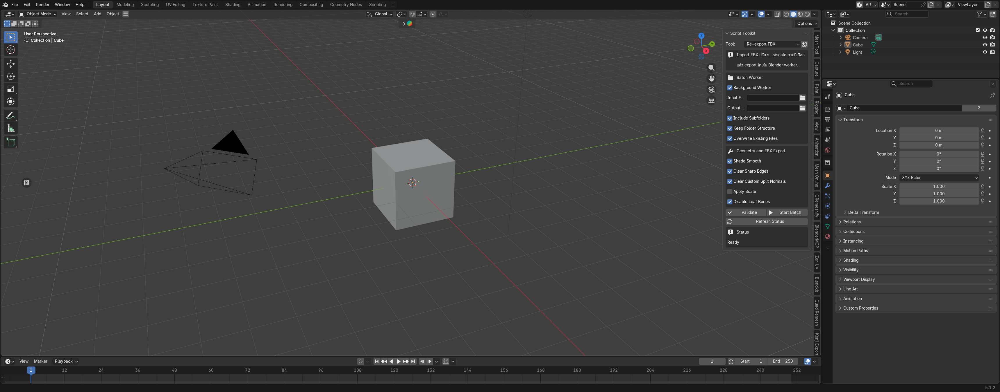

# Script Toolkit 🛠️

A collection of handy scripts and utilities for Rigging, Animation, and Workflow optimization in Blender.

## Features
- **Advanced Symmetry Weight Mirror**: Mirror vertex weights perfectly across the X-axis, supporting prefix renaming (e.g. `Bip001 R` to `Bip001 L`).
- **Biped Names Helper**: Temporarily convert Biped bone names to standard Blender `.L`/`.R` suffixes for easy mirroring, then restore them.
- **ARP Retarget Preset**: Build complete source/target bone mappings, multi-select rows by clicking, swap or mirror mappings, and import/export Auto-Rig Pro `.bmap` presets.
- **KJ Export**: Batch export selected meshes with a pinned armature through the Better FBX exporter, including presets, smooth shading, and Biped name restoration.
- **Clear Custom Properties**: Strip all custom properties/metadata from selected objects to clean up imported models (like from 3ds Max/Maya).
- **Built-in Auto Updater**: Keep your add-on up to date directly from Blender.

Runtime feature modules are grouped under `features/`; the add-on is installed and updated as one package.

## Installation
1. Download the latest `.zip` from the [Releases page](https://github.com/char8294/ScriptToolkit_Blender_Addon/releases).
2. In Blender, go to `Edit > Preferences > Add-ons`.
3. Click `Install...` and select the `.zip` file.
4. Check the box to enable **Script Toolkit**.
