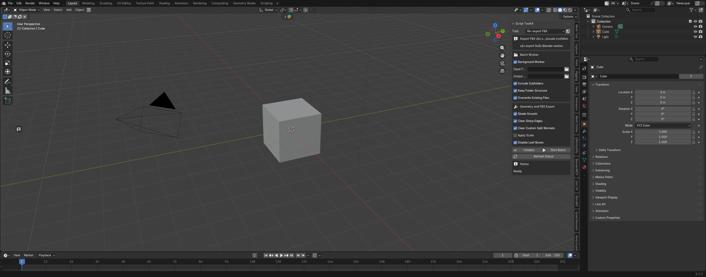

# Script Toolkit 🛠️

A collection of handy scripts and utilities for Rigging, Animation, and Workflow optimization in Blender.

## Features
- **Advanced Symmetry Weight Mirror**: Mirror vertex weights perfectly across the X-axis, supporting prefix renaming (e.g. `Bip001 R` to `Bip001 L`).
- **Biped Names Helper**: Temporarily convert Biped bone names to standard Blender `.L`/`.R` suffixes for easy mirroring, then restore them.
- **ARP Retarget Preset**: Build complete source/target bone mappings, multi-select rows by clicking, swap or mirror mappings, and import/export Auto-Rig Pro `.bmap` presets.
- **KJ Export**: Batch export selected meshes with a pinned armature through the Better FBX exporter, including presets, smooth shading, Biped name restoration, and per-mesh unused-bone removal.
- **FBX Import/Export Option**: Add a Script Toolkit panel to Blender's current FBX Import/Export options with Universal Root Bone controls and Ignore Armature Node.
- **Align Bones**: Snap selected tails to nearby selected heads or point them along a World Axis, and convert selected bone axes with FBX-style Primary/Secondary source and target settings while preserving the current pose.
- **Clear Custom Properties**: Strip all custom properties/metadata from selected objects to clean up imported models (like from 3ds Max/Maya).
- **Create Root Motion**: Create colored helper Shapes for multiple selected bones, open Blender's native Bake Action dialog, and add Copy Location/Rotation constraints by matching bones to `RM_` Object names.
- **Turntable Camera**: Create camera or model turntable animations from the Script Toolkit panel.
- **Quick Render**: Render viewport-visible or selected objects with camera, engine, resolution, output, and batch controls.
- **Learn Node Blender**: The Learn Node HUD runs continuously in the Geometry Node Editor; the Script Toolkit entry points to its Node page.
- **Built-in Auto Updater**: Keep the Script Toolkit package up to date directly from Blender.

Runtime feature modules are grouped under `features/`, including the Learn Node JSON data; the add-on is installed and updated as one package.

## Installation
1. Download the latest `.zip` from the [Releases page](https://github.com/char8294/ScriptToolkit_Blender_Addon/releases).
2. In Blender, go to `Edit > Preferences > Add-ons`.
3. Click `Install...` and select the `.zip` file.
4. Check the box to enable **Script Toolkit**.
